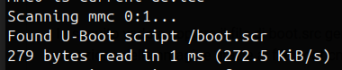

## Configuration de Buildroot

1) Cloner Buildroot dans un nouveau dossier dans `workspace` :

```bash
cd workspace
git clone https://github.com/buildroot/buildroot.git buildroot2
cd buildroot2
```

2) Se placer sur la bonne version de Buildroot (2022.08.3) :

```bash
git checkout -b ses 2022.08.3
```

3) Copier le fichier `defconfig` du NanoPi Neo Plus2 :

```bash
cp configs/friendlyarm_nanopi_neo_plus2_defconfig configs/ses_defconfig
```

4) Créer le dossier pour les patchs :

```bash
mkdir -p board/friendlyarm/nanopi-neo-plus2/patches
```

5) Charger automatiquement dans Buildroot la configuration `ses_defconfig` :

```bash
make ses_defconfig
```

6) Lancer `menuconfig` pour ajuster les options comme décrit dans le laboratoire :

```bash
make menuconfig
```

Une fois les options modifiées, les sauvegarder dans le fichier `.config` (fichier de sauvegarde par défaut).

7) Lancer la compilation :

```bash
make
```


## Questions


1) L'erreur de la question indique que le fichier boot.cmd n'existe pas ici **board/friendlyarm/nanopi-neo-plus2/boot. cmd** et provoque donc l'échec de la compilation. Pour résoudre ce problème, il suffit de copier le fichier boot.cmd de **resources/buildroot/board/friendlyarm/nanopi-neo-plus2/boot.cmd** vers **/workspace/buildroot2/board/friendlyarm/nanopi-neo-plus2/** et de relancer la commande make.


2) L'erreur de la question indique une erreur concernant le 3ème argument d'une fonction dans le fichier `services/std_svc/psci_common.c` à la ligne 264.
Pour corriger cette erreur, nous pouvons nous rendre dans le dossier `./ouput/build/arm-trusted-firmware-*****/`.

Ce dossier contient un clone du module responsable de cette erreur. Une fois dans ce dossier, la commande `git remote` nous indique qu'une seule remote existe pour ce repo git, la remote nommée `origin`. Nous pouvons donc faire `git remote get-url origin` qui nous donne `https://github.com/apritzel/arm-trusted-firmware.git`.

Une fois ce repo cloné (ailleurs dans le système). On peut donc checkout le même commit que buildroot afin de travailler avec la même base : `git checkout aa75c8da`. Une fois ce commit selectionné, nous pouvons donc modifier le fichier `services/std_svc/psci_common.c` à la ligne 264 pour modifier les paramètre attendu de la fonction et rajouter la taille du tableau.

Ensuite, nous pouvons créer un nouveau commit avec ces changements, puis exécuter la commande `git format-patch -1` qui génère donc un fichier patch contenant les modifiation effectuées dans le dernier commit.

Il suffit ensuite de déplacer ce fichier .patch dans le dossier `board/friendlyarm/nanopi_neo_plus2/patches/arm-trsuted-firmware/0001-<patch name>.patch`. Ensuite, ne pas oublier le `make clean` afin de nettoyer l'essai précédent. Pour finir, relancer le build avec `make -j`


3)  Pour résoudre le problème une fois intercepté, il faut déconnecter le nano-pi, insérer la carte SD dans le convertisseur SD. Après avoir vérifié avec un `lsblk` que la carte SD est correctement connectée, il faut monter une partition de la carte SD, à savoir la partition `sda1`, la plus petite, qui sert à démarrer le nano-pi et qui contient le fichier `extlinux.conf`. J'exécute donc la commande :

```bash
sudo mount /dev/sda1 /mnt
```

Cette commande permet de monter la partition `sda1` dans le dossier `/mnt`.
Une fois cela fait, on renomme le fichier `extlinux.conf` pour s'assurer qu'une fois le fichier `boot.src` créé, le périphérique démarre avec le bon fichier.
On exécute donc cette commande :

```bash
sudo mv /mnt/extlinux/extlinux.conf /mnt/extlinux/extlinux.conf.bak
```

On peut aussi le supprimer si besoin. Ensuite, on copie le fichier `boot.scr` généré lors de la création de l'image grâce au fichier `boot.cmd`.
On recherche ensuite le chemin d'accès exact du fichier `boot.scr` et on le copie dans le dossier `/mnt` de la manière suivante :

```bash
sudo cp ./output/images/boot.scr /mnt/boot.scr
```

Enfin, on démonte la partition `sda1` avec :

```bash
    sudo umount /mnt
```

Il est important d'effectuer cette étape pour éviter la corruption des données et des fichiers.
On peut maintenant réinsérer la carte SD dans le nano-pi, connecter la connexion série et l'alimentation, puis effectuer :

```bash
sudo picocom -b 115200 /dev/ttyUSB0
```

De cette manière, l'interface du nano-pi sera activée et lors du démarrage, on obtiendra le résultat suivant :




Cela nous indique que le nano-pi démarre avec le bon fichier.
